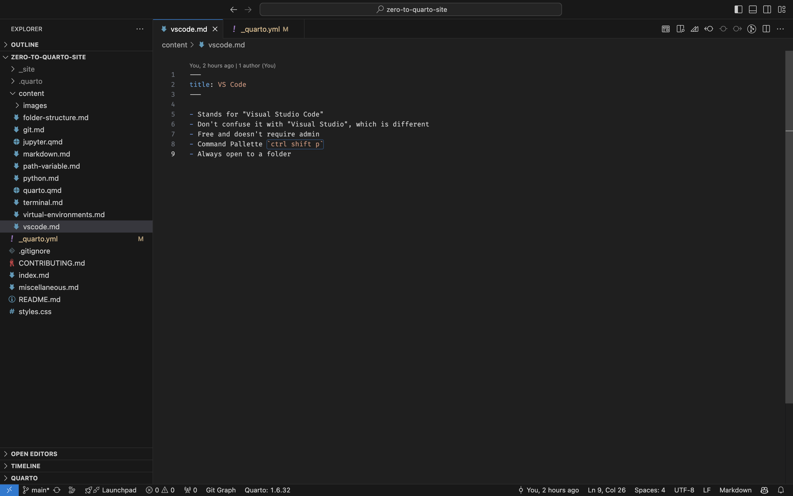

## Install Visual Studio Code

- Install VS Code
- Usually shortened to "VS Code"
- Don't confuse it with "Visual Studio", which is different
- Free and doesn't require admin

---

## GitHub Account

- Make a GitHub account
- It's free

---

## Google Account

- Have a google/gmail account (probably optional, but recommended)
- Also free
