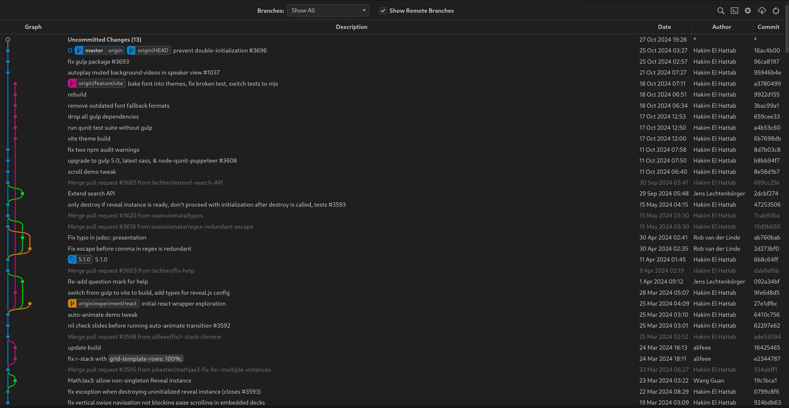
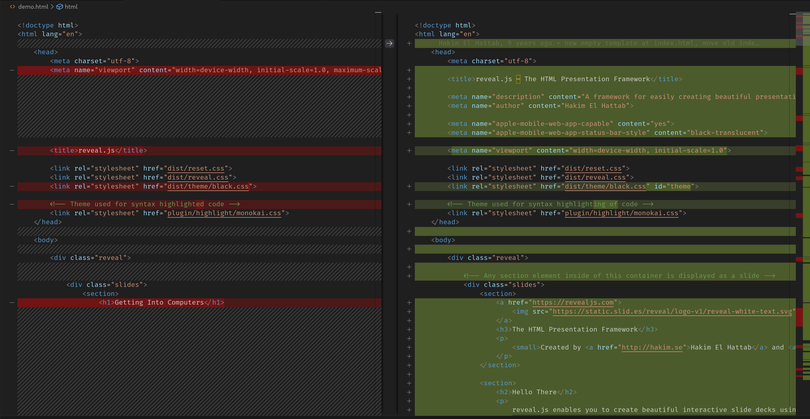
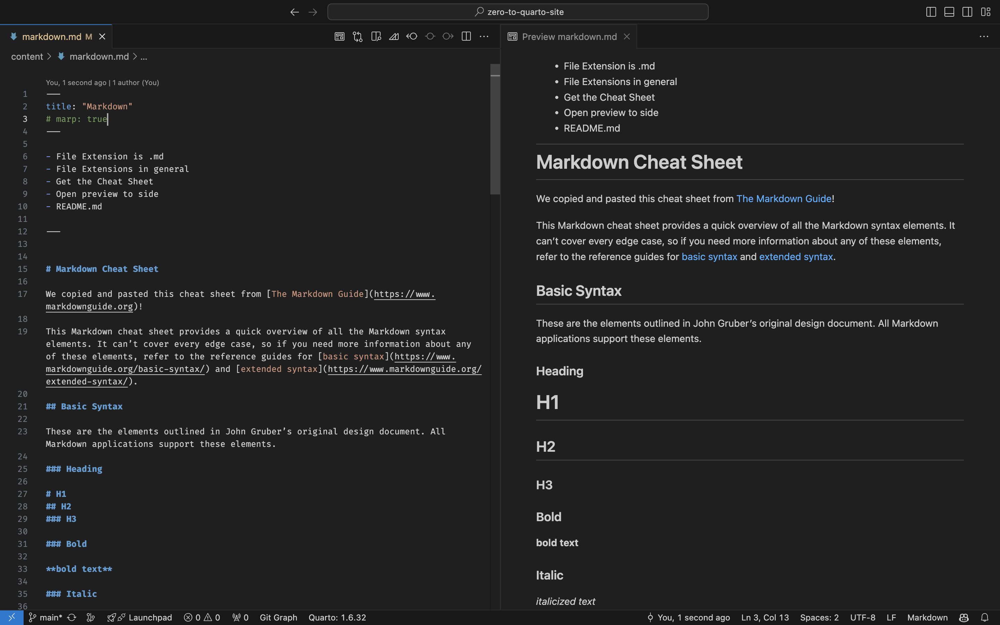

Here are some previews of things to come:

---

# VS Code

This is the text editor we'll be using.

---

# Git Graphs

These help you track your and your colleague's
work so you can determine who changed what and when.

---

# Comparing Files

Shows the difference between two files.

---

# Tracking Changes

Shows the difference between an old and new
version of the same file.

---

# Markdown

Allows you to write documents and take notes
in a programmer-friendly way. This might become
your note-taking and writing method of choice.

---

# Python and Jupyter

Python is the programming language we will use.

One way to use it is in Jupyter Notebooks, which
is shown here.

---

# Terminal

We'll work on the basics of how to use the terminal.

