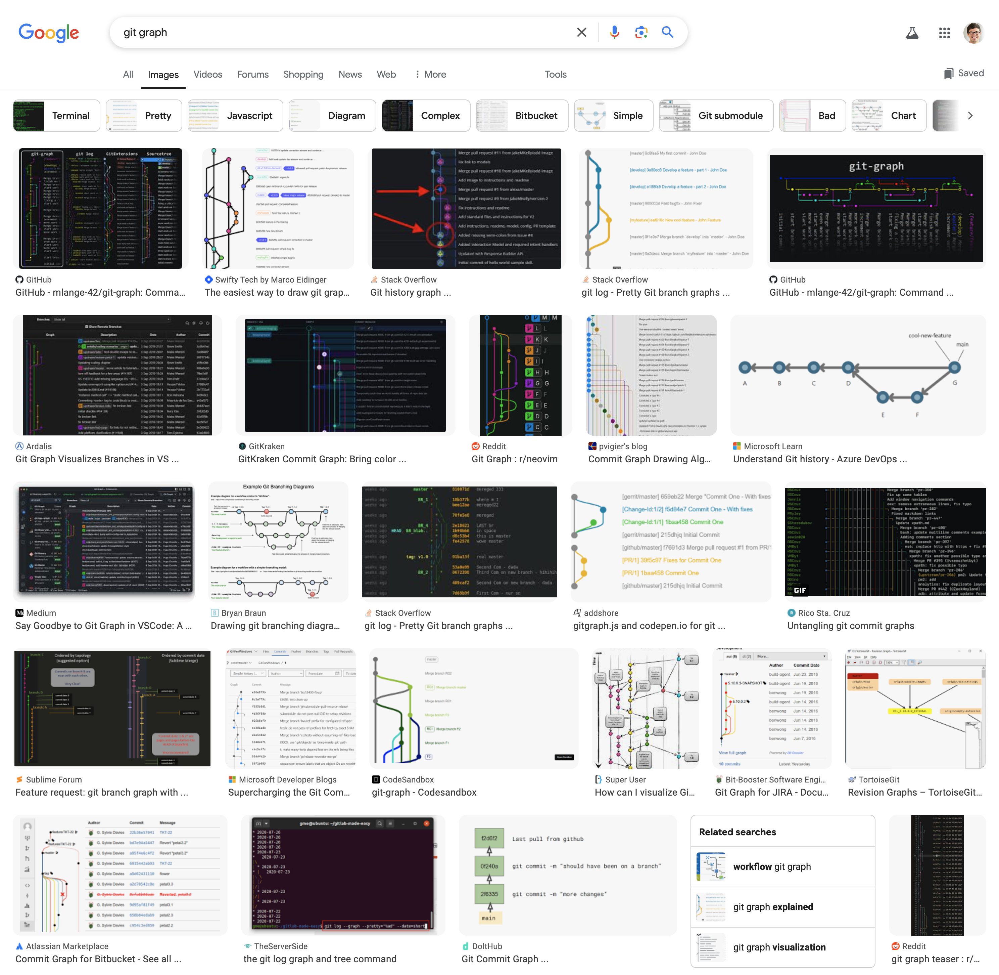

Here are some playgrounds as a preview for things to come:

- [Markdown Playground](https://dillinger.io/) and [dotmd editor](https://dotmd-editor.vercel.app/)
- [Diff Checker](https://www.diffchecker.com/text-compare/)
- Python
  - [Google Colab](https://colab.research.google.com)
  - [Python Shell](https://www.python.org/shell/)
  - [Online Python](https://www.online-python.com/)
- [VSCode](https://vscode.dev/)
  - if you have github, try a [GitHub Codespace](https://github.com/codespaces)
    (and click "use this template" under "blank").
- [terminal playground](https://jslinux.org)

---

# Git and Git Graphs

Google search "Git graph", and scroll through the images

