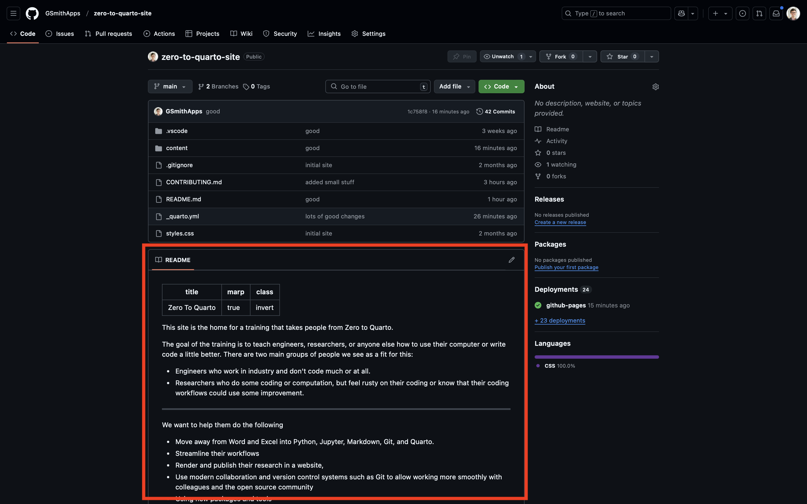

# This Site's Code

- The code that makes this site is [here↗](https://github.com/GSmithApps/zero-to-quarto-site)
- It's on site called GitHub, which is like Google Drive
  mixed with a social network, and programmers use it to
  keep and share their code.
  - In GitHub, a top-level folder is called a ***repository***, or ***repo***.

---

# Feel Free to Explore

- Click the ***Content*** folder

- Click the ***z00.z05.this-site.md*** file
  - Right above the file, where it has three options of
    ***Preview***, ***Code***, and ***Blame***, click ***Code***.
  - This is the code that makes this page!
    (it might be slightly out of sync)

---

# READMEs

All repos should have a README file at the top level.
It tells people what's going on in the repo.
And many people (including us) are fans
of READMEs, and encourage putting them in any folder,
in addition to just the top level.
In fact, one of the most famous programmers in the world
(he made GitHub), suggests that [the first thing you
should do is write a README](https://tom.preston-werner.com/2010/08/23/readme-driven-development).

In GitHub, the README is the file that's rendered below
the list of files:

