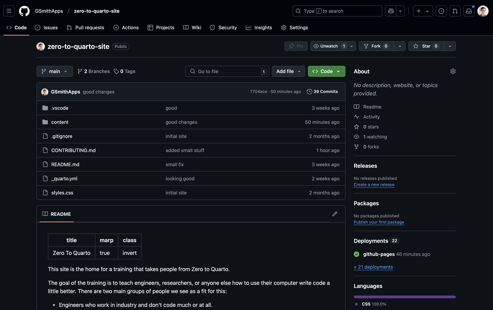
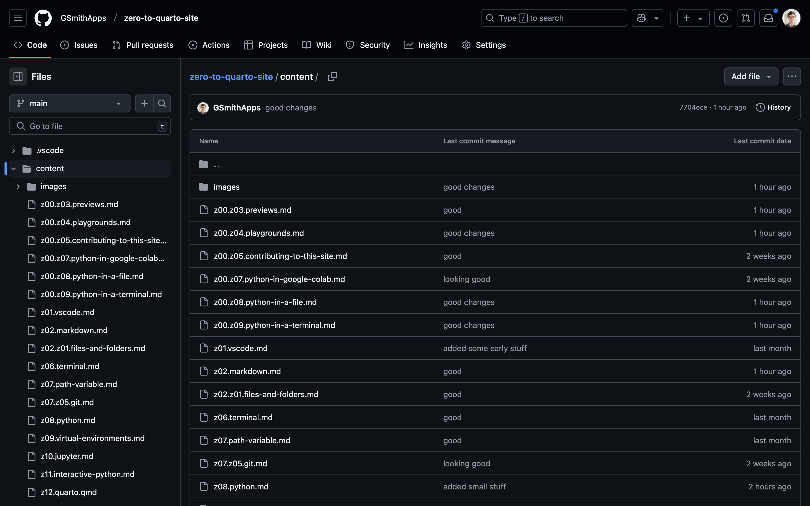
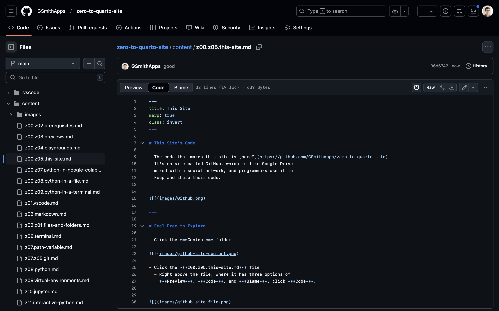

# This Site's Code

- The code that makes this site is [here↗](https://github.com/GSmithApps/zero-to-quarto-site)
- It's on site called GitHub, which is like Google Drive
  mixed with a social network, and programmers use it to
  keep and share their code.

---

# Feel Free to Explore

- Click the ***Content*** folder

- Click the ***z00.z05.this-site.md*** file
  - Right above the file, where it has three options of
    ***Preview***, ***Code***, and ***Blame***, click ***Code***.

