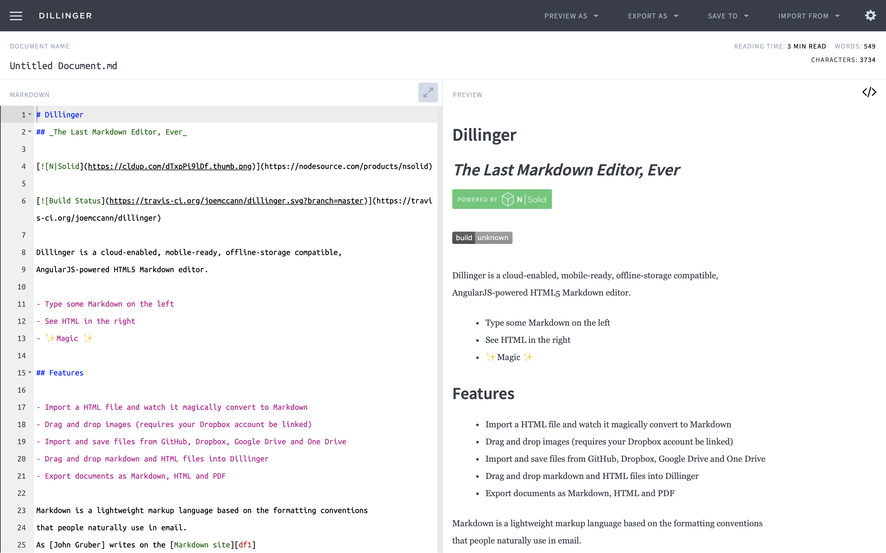
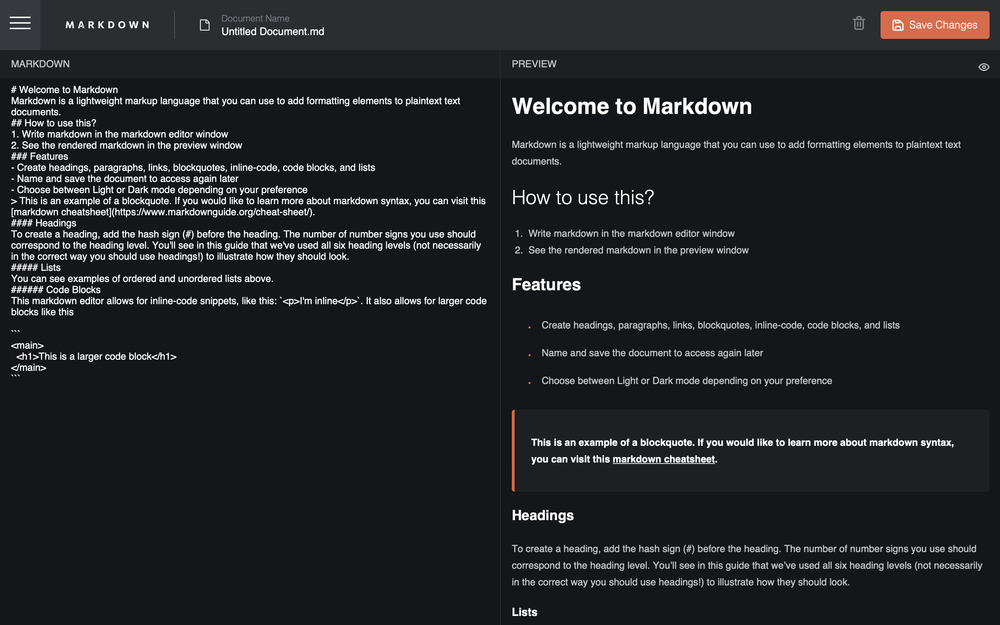
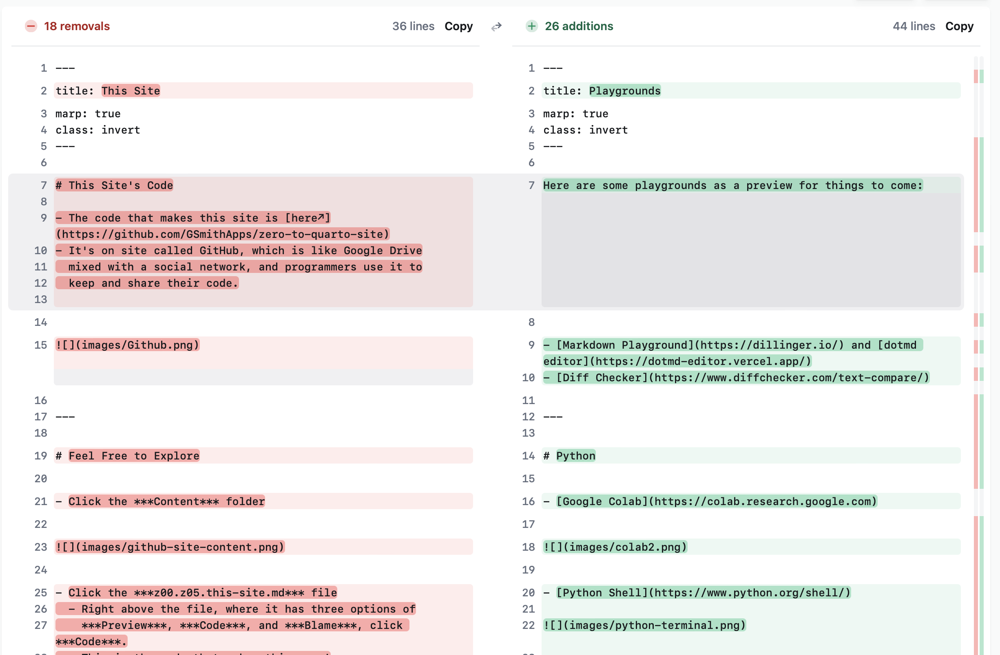
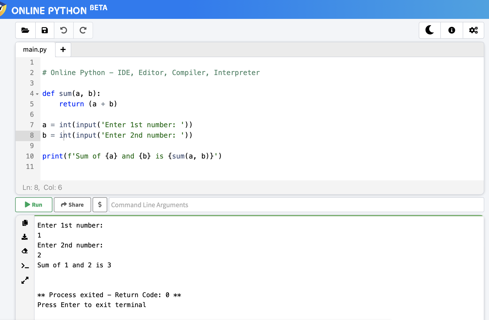
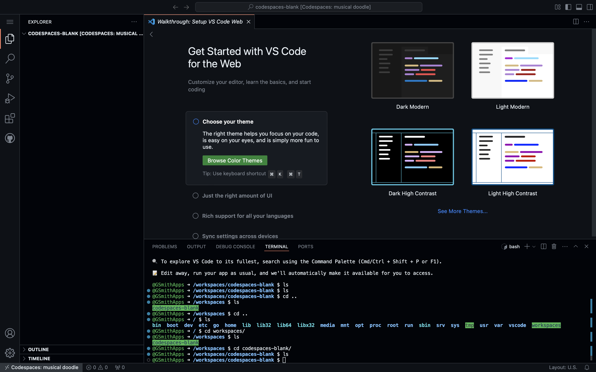
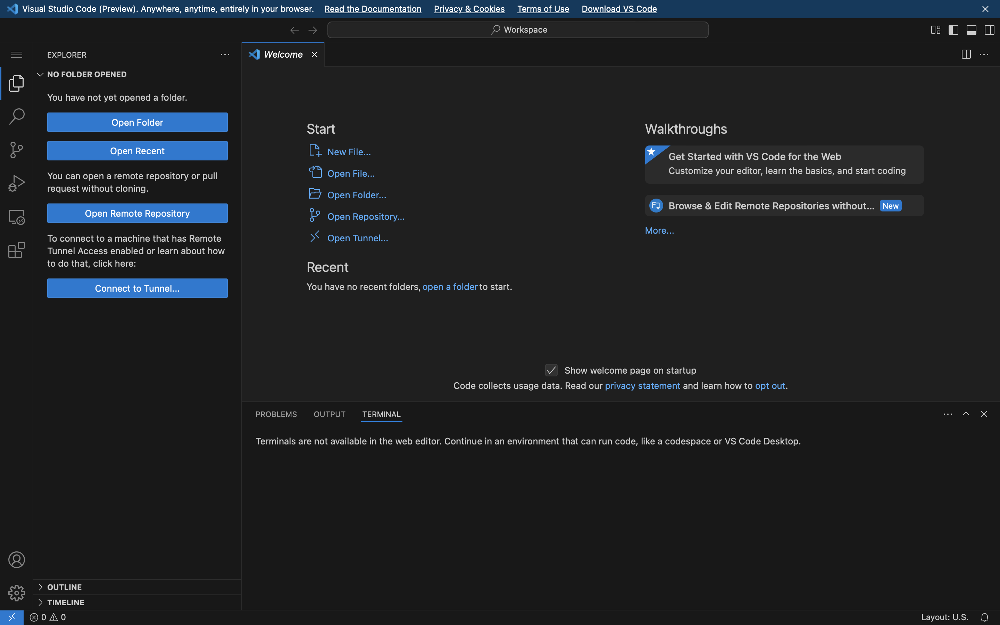
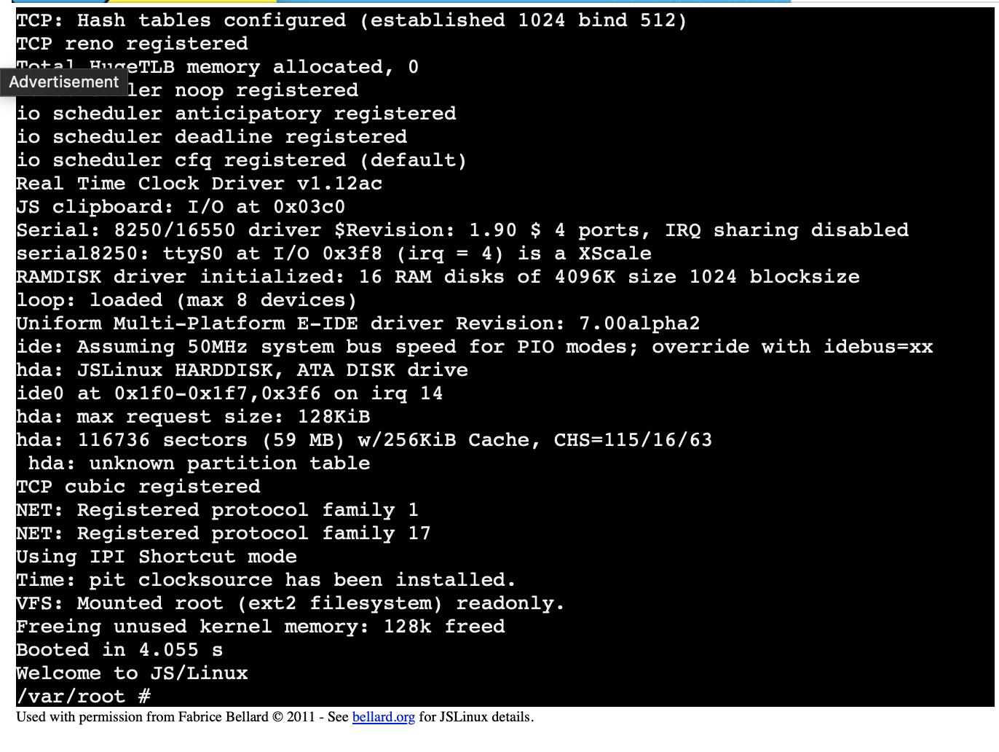

Here are some playgrounds as a preview for things to come:

---

## Markdown

- [Markdown Playground](https://dillinger.io/)

- [dotmd editor](https://dotmd-editor.vercel.app/)

---

## Git Diffs

- [Diff Checker](https://www.diffchecker.com/text-compare/)

---

## Python

- [Google Colab](https://colab.research.google.com)

- [Python Shell](https://www.python.org/shell/)

- [Online Python](https://www.online-python.com/)

---

## VS Code

- If you have a GitHub account, try a [GitHub Codespace](https://github.com/codespaces)
  (and click "use this template" under "blank").

- If you don't have a GitHub account, try [VSCode](https://vscode.dev/)

---

## Terminal

- If you have a GitHub account, you can use the terminal at the
  bottom of the codespace

(Same image as [above](z00.z06.playgrounds.md#vs-code))

- If you don't have a GitHub account, try [Terminal Playground](https://jslinux.org)

