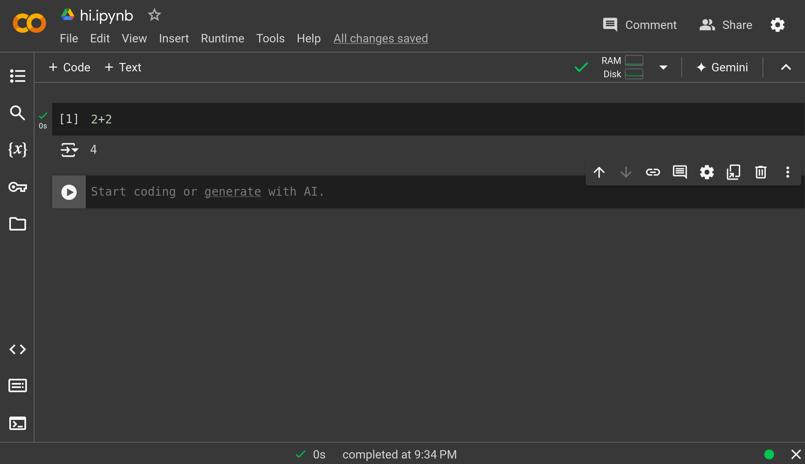

Can run Python code whenever you want without installing anything
by going to [Google Colab](https://colab.research.google.com).




---

# Can run code in the cells

Try typing

```python
2+2
```

And hit `shift`+`enter`.

It should display the output below.

---

# Can Put in Text Cells

- Can write text in that document
- It supports Markdown