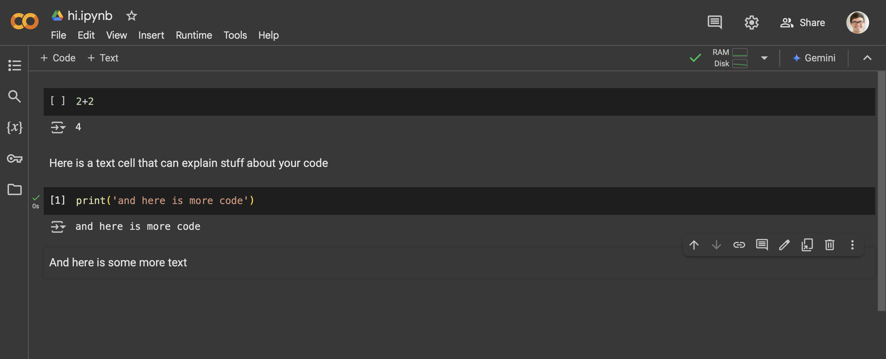

Can run Python code whenever you want without installing anything
by going to [Google Colab](https://colab.research.google.com).


---

## Can run code in chunks

You can run code in chunks, and see the output as you go.

Try typing

```python
2+2
```

And hit `shift`+`enter`.

It should display the output below the code.

---

## Can Put in Text Cells

You can also write text between the code cells,
which can help explain your code.

It supports Markdown, which we'll discuss more
throughout this training.


