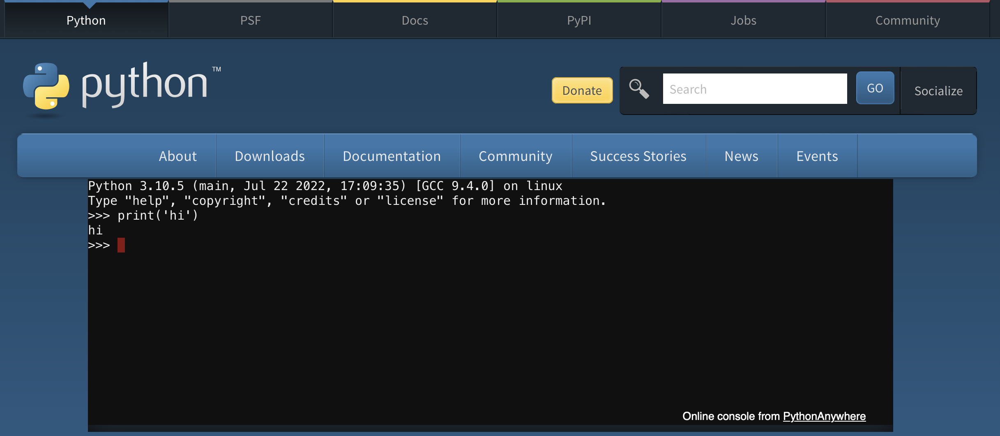

Can run Python code in a terminal whenever you want without installing anything
by going to [Python's online shell](https://www.python.org/shell/).




---

# Can type code and hit enter

Try typing

```python
2+2
```

And hit `enter`.

It should display the output below.