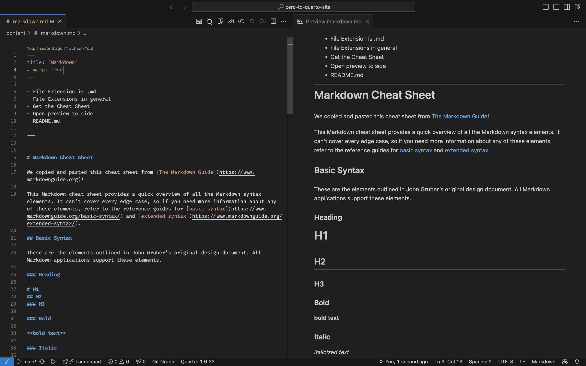

# Goals of Markdown

- Write pretty text that can be used to make websites
  (and really anything) using plain text
  - Because it's plain text, it's easy to version
    control, and you can open it in any application.
    It is very simple and universal
- It can be rendered to look extra pretty,
  but is pretty enough even without rendering.

---

# Fast Facts

- Playgrounds: [Markdown Playground](https://dillinger.io/) and [dotmd editor](https://dotmd-editor.vercel.app/)
- File Extension is .md
- File Extensions in general
- Get the Cheat Sheet
- README.md
  - Is what's rendered in GitHub.
  - Is what people look for when they open a folder.
- pressing enter doesn't put a return in the rendered
  text -- you need to press enter twice.

---

# Open preview to side




---


# Markdown Cheat Sheet

We copied and pasted this cheat sheet from
[The Markdown Guide](https://www.markdownguide.org).
It's helpful to view this cheat sheet next to the rendering
so you can see how it was typed and what it rendered.
Here's the cheat sheet:

## Basic Syntax

These are the elements outlined in John Gruber’s original design document. All Markdown applications support these elements.

### Heading

# H1
## H2
### H3

### Bold

**bold text**

### Italic

*italicized text*

### Blockquote

> blockquote

### Ordered List

1. First item
2. Second item
3. Third item

### Unordered List

- First item
- Second item
- Third item

### Code

`code`

### Link

[Markdown Guide](https://www.markdownguide.org)

### Image


## Extended Syntax

These elements extend the basic syntax by adding additional features. Not all Markdown applications support these elements.

### Table

| Syntax | Description |
| ----------- | ----------- |
| Header | Title |
| Paragraph | Text |

### Fenced Code Block

```
{
  "firstName": "John",
  "lastName": "Smith",
  "age": 25
}
```

### Footnote

Here's a sentence with a footnote. [^1]

[^1]: This is the footnote.

### Heading ID

### My Great Heading {#custom-id}

### Definition List

term
: definition

### Strikethrough

~~The world is flat.~~

### Task List

- [x] Write the press release
- [ ] Update the website
- [ ] Contact the media

### Highlight

I need to highlight these ==very important words==.

### Subscript

H~2~O

### Superscript

X^2^