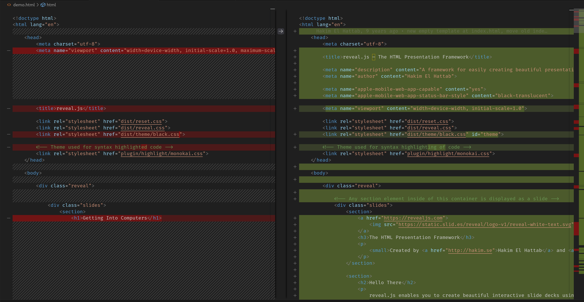

Git is for version control.

It lets you see differences between versions of files.

It also lets you collaborate with people across the world.

# Diffs

# Compare Files

# Git Graph

# Gotchas

- Each commit is a snapshot of the repository, so big files can accumulate in storage
